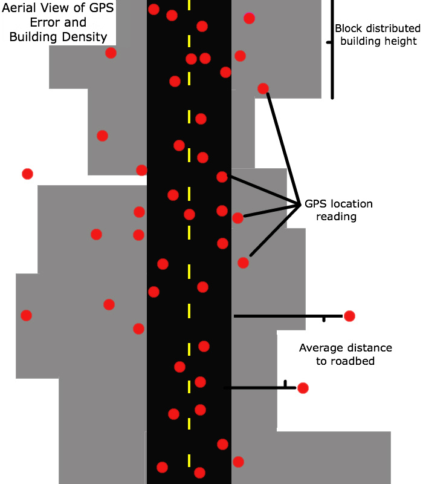
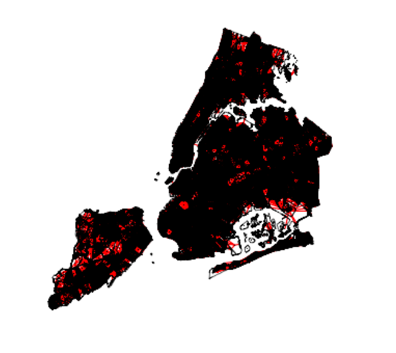
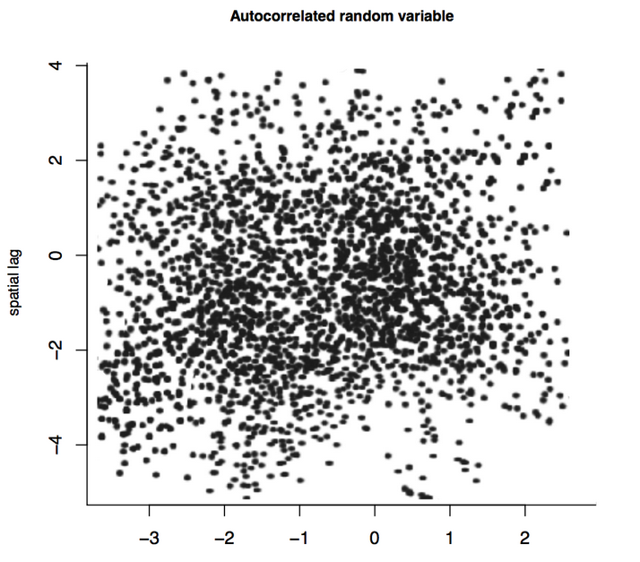
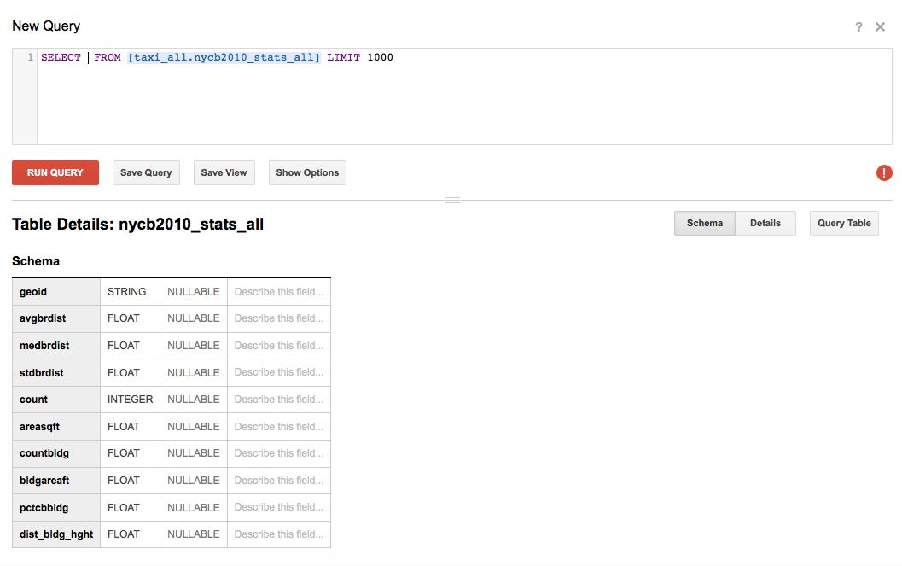
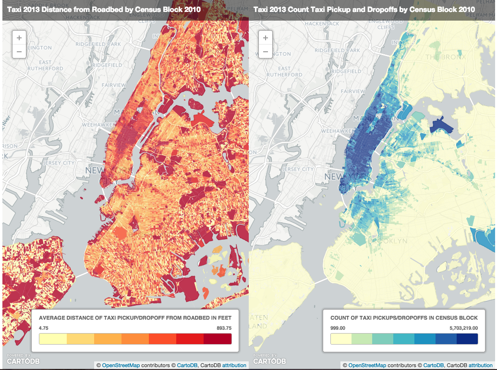
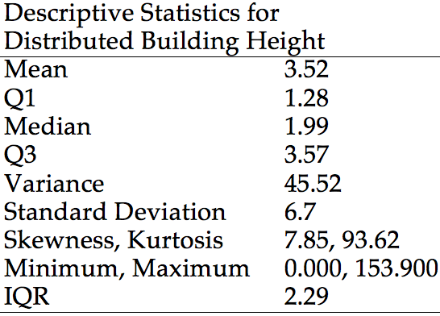

##Two analytic approaches
* Individual geographical points 
    * latitude and longitude of each pickup and dropoff
* Areal units 
    * In this case census blocks
    * Polygons

##Areal data are subject to many analytic difficulties 
* Weird geographic categorizations (i.e. congressional districts)
* Spatial autocorrelation
    * Idea that things next to each other are likely to be more similar than things far apart from each other
    * A tall building on block is likely to be surrounded by other tall buildings 

##How can we overcome this problem?
* If we are considering lat/long points then we can weight them by decreasing levels of distance
* If we are considering blocks then we can think about them as neighbors, applying a few different definitions 

##Point based analysis
347 million latitude and longitude points is perhaps too complex for this anlaysis. 
But, we can take a random sample
Big Query random sample code

##Block based analysis
Examining block-level data makes sense because distributed building height and distance to roadbed were calculated for each census block

##How do you define a neighbor?
* Do the polygons share a border?
* How many degrees are they away from each other (six degrees of Kevin Bacon)?

##How do you actually accomplish this in R?
Step 1: Read in census block (or zip code) shapefile from the  [NYC Department of City Planning](http://www.nyc.gov/html/dcp/html/bytes/districts_download_metadata.shtml)
      
    library(maptools)
        block <- readShapePoly('/Users/emiliebruzelius/Desktop/git/taxi/taxi/nycb2010_15a/nycb2010.shp')
        zips <- readShapePoly('/Users/emiliebruzelius/Desktop/git/taxi/taxi/nyc2010/nyc2010.shp')

##Step 2: Create neighbors 
* spdep package in R
* poly2nb() function in spdep takes spatial polygons and returns a list of neighbors 

        library(sp)
        library(spdep)
        
        length(block)
        block.nb <- poly2nb(block)
        head(block.nb)
        
        plot(block.nb, coordinates(block), 
            col = "red", pch = ".")
        plot(block, add = T)

        coords <- coordinates(block)
        IDs <- row.names(coords)

        block.nb3 <- graph2nb(gabrielneigh(coords), 
                      row.names = IDs)
        plot(block.nb3, coords, pch = ".", col = "red")
        plot(block.nb3, add = T)

##Census block neighbors

##In comparison - Zip code neighbors

     library(tripack)
     coords <- coordinates(nycZIPS2)
     IDs <- row.names(coords)
     nycZIPS.nb4 <- tri2nb(coords, row.names = IDs)
     plot(nycZIPS.nb4, coords, pch = ".", col = "red")
     plot(nycZIPS2, add = T)
     

####Zip Code Neighbors

##Step 3: Assign spatial weights and test 

      block.wts <- nb2listw(block.nb3, 
                   zero.policy = T, style = "B")
      print(block.wts, zero.policy = T)
      names(block.wts)      
      set.seed(987654)
      n <- length(block.nb3)
      uncorr.x <- rnorm(n)
      rho <- 0.05
      autocorr.x <- invIrW(block.wts, rho, 
                     feasible = TRUE) %*% uncorr.x
      plot(autocorr.x, lag(block.wts, autocorr.x), 
      xlab = "Autocorrelated Variable",
      main = "Autocorrelated Variable",
      cex.main = 0.8, cex.lab = 0.8)
      moran.x <- moran.test(autocorr.x, listw = block.wts, zero.policy = T)
      moran.x
      moran.cases <- moran.test(block2$cases, listw = block.wts, + 
         zero.policy = TRUE)
      moran.cases
       
      Morans I test under randomisation
      data:  block2$cases
      weights: block.wts
      Moran I statistic standard deviate = .2337, p-value < 2.2e-16

<small>GPS error location in New York City is (sort of) spatially dependent</small>

####How does that relate to building density?

##Create big query query
      library(bigrquery)
      project <- "dazzling-will-91618" # project name
      sql_master <- "SELECT * FROM [dazzling-will-91618:taxi_all.taxi_all_2013]" # master
      sql_block <- "SELECT * FROM [dazzling-will-91618:taxi_all.nycb2010_stats_all]" # geoid census block 2010
      sql_points <- "SELECT tuid FROM [dazzling-will-91618:taxitest.taxi5]" # lat/lon points 
      sql_random <- "(SELECT rand() as random, 
                     * FROM [pdazzling-will-91618:taxitest.taxi5] ORDER BY random) LIMIT 10000" #random sample

      dfs <- query_exec(sql_stats, project = project,)
      dfb <- query_exec(sql_block, project = project,)
      dfr <- query_exec(sql_random, project = project, max_pages = Inf)

##Clean up the data
* Drop blocks with missing heights
* Drop blocks with missing building counts
* Drop blocks with missing GPS counts

      dfb2 <- dfb
      dfb2$dist_bldg_hght[dfb2$dist_bldg_hght<=0] <- NA
      dfb2$count[dfb2$countbldg<=0] <- NA
      dfb2$count[dfb2$count<=0] <- NA
      dfb2 <- dfb2[complete.cases(dfb2), ]

##Block data
* 38,716 census blocks total
* 3,924 blocks with missing building info
* 772 with missing building count info 
* 1,230 with missing trip counts (entire count metric missing not missing 1 count)

## Final sample 
* 32,790 blocks
* Average block: 32 buildings
* 1 building blocks: 6,974
* Average pick up and drop off points per block: 8,668
* Maximum pick up/drop off points per block 5,654,000 

